# Spotify Sorter

A modern desktop application for managing and organizing your Spotify playlists with advanced sorting, duplicate detection, and version replacement features.


## Features

- **Dynamic Playlists**: Create rules-based playlists that update automatically (e.g., "All Liked Songs by [Artist] from the 90s")
- **Automated Scheduling**: Schedule your playlist updates to run daily, weekly, or hourly (Native Desktop & Web App support)
- **Compare Playlists**: Identifies common tracks and unique items across multiple playlists with one-click cleanup
- **Export Formats**: Export playlist data to CSV, M3U (for DJ software), or Automation Configs
- **Multi-Criteria Sorting**: Chain rules like *Release Date (Newest) > Artist (A-Z) > Energy (High)*
- **Duplicate Detection**: Smart identification and removal of duplicate tracks across your library
- **Version Replacer**: Automatically upgrades tracks to preferred versions (Remasters, Originals, etc.)
- **Interactive History**: Full undo/redo support, individual entry deletion, and session clearing
- **System Tray Ecosystem**: Run updates, manage schedules, and open backups/exports directly from the tray
- **Background Persistence**: "Close to Tray" ensures your schedules run 24/7 without cluttering your taskbar
- **Self-Hosted Web Server**: Companion Docker image for headless 24/7 automation on Unraid/Synology/NAS

<details>
<summary><strong>View Application Screenshots</strong></summary>
<br>

### Desktop Application

| Main Interface | Dynamic Playlist Editor |
|---|---|
|  | 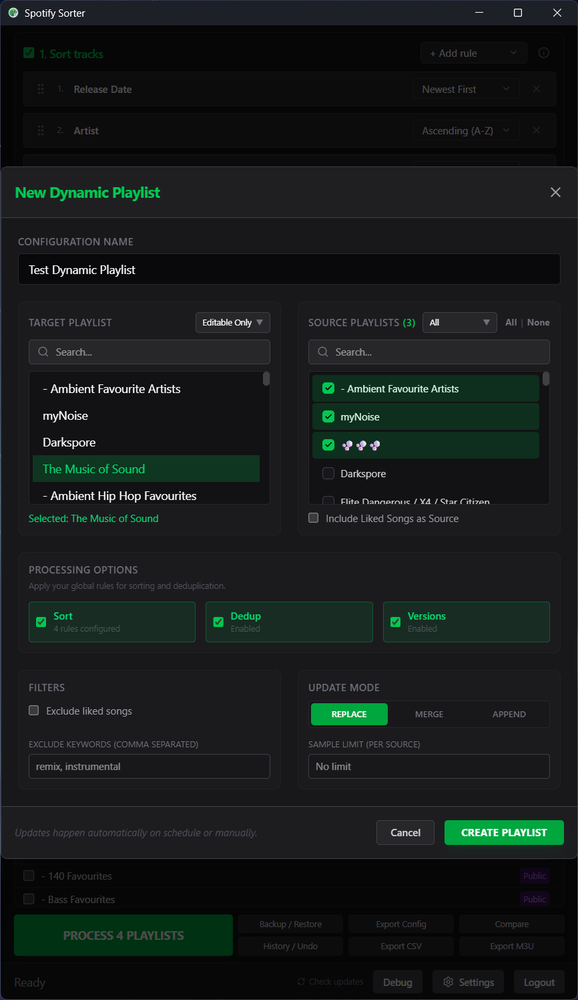 |

| Compare Playlists | History & Undo |
|---|---|
| 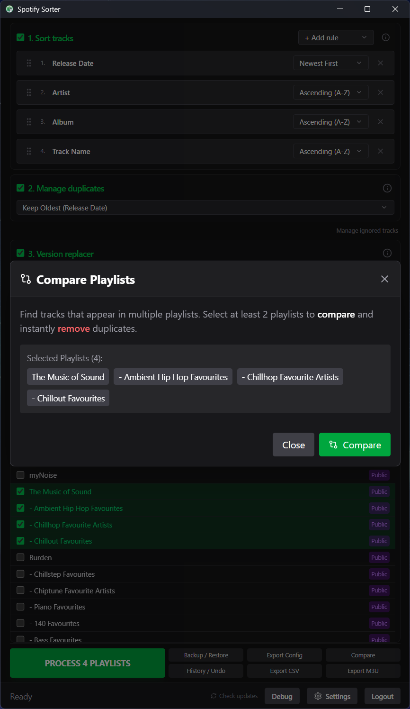 | 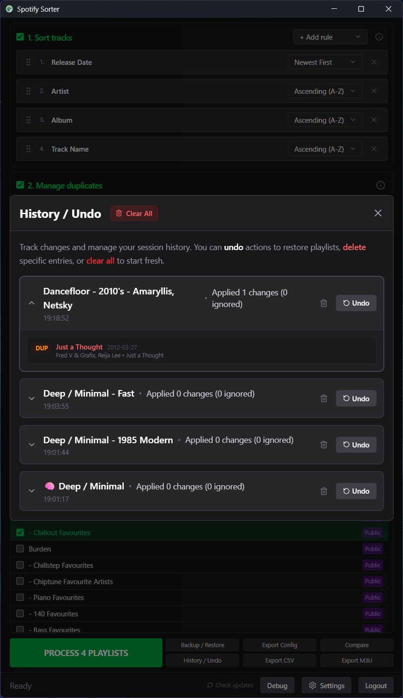 |

| Schedule Editor | Application Settings |
|---|---|
| 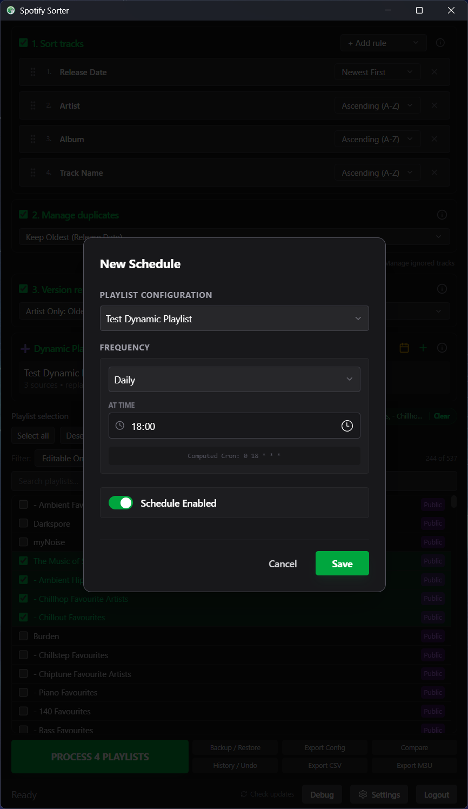 | 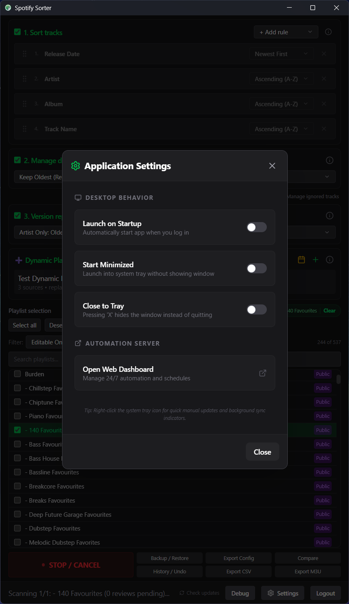 |

| Backup & Restore | Ignored Tracks |
|---|---|
| 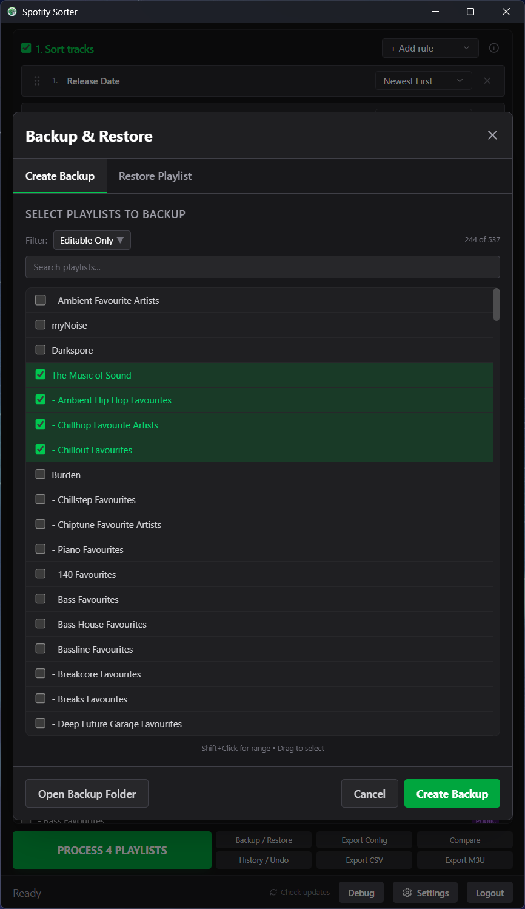 | 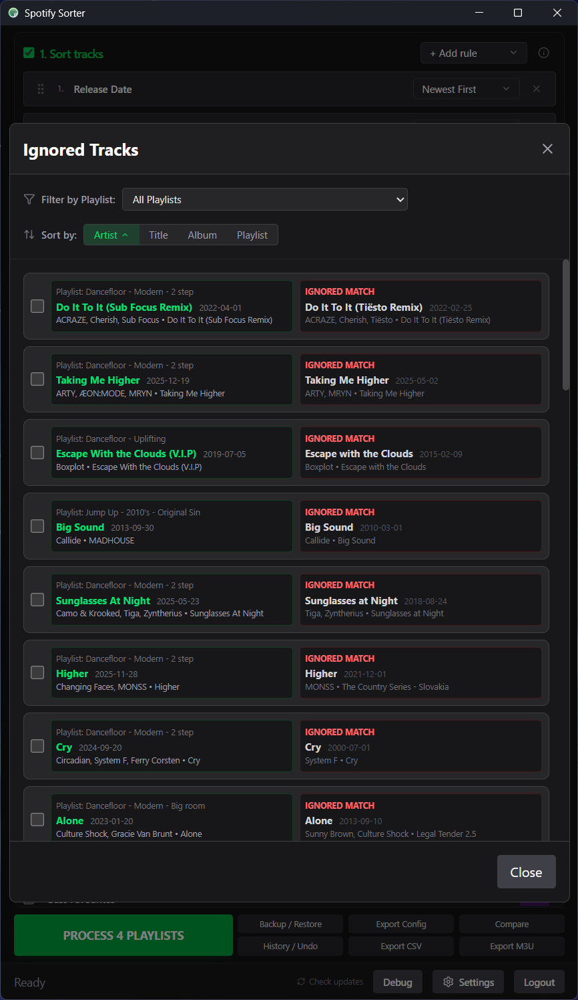 |

| Export M3U | Export CSV |
|---|---|
| 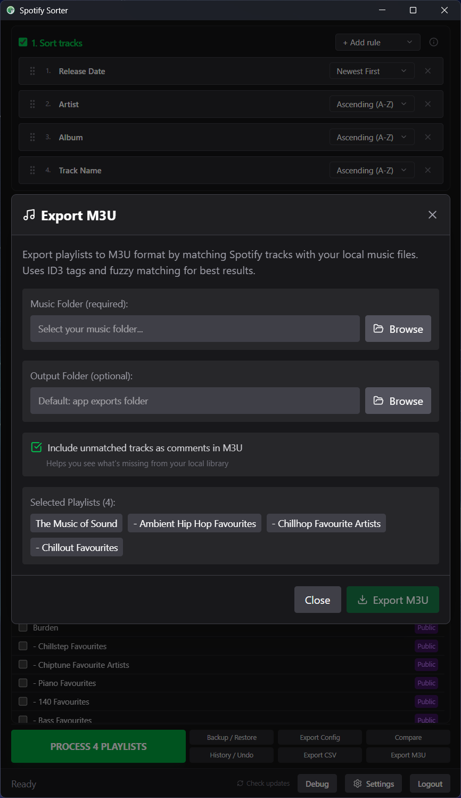 | 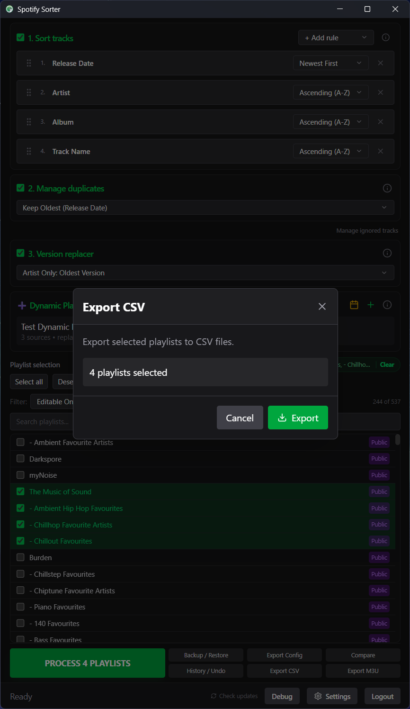 |

### Web Dashboard

| Dashboard Overview | Playlist Editor |
|---|---|
| 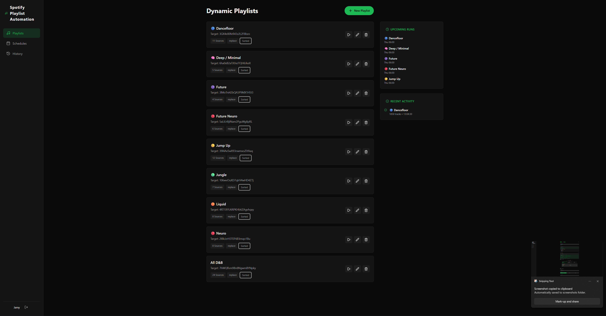 | 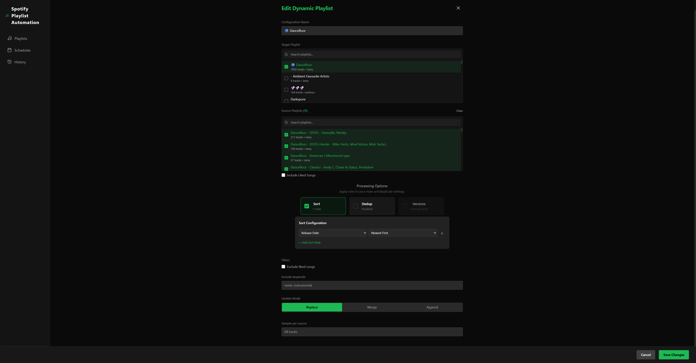 |

| Schedule Manager | History Log |
|---|---|
| 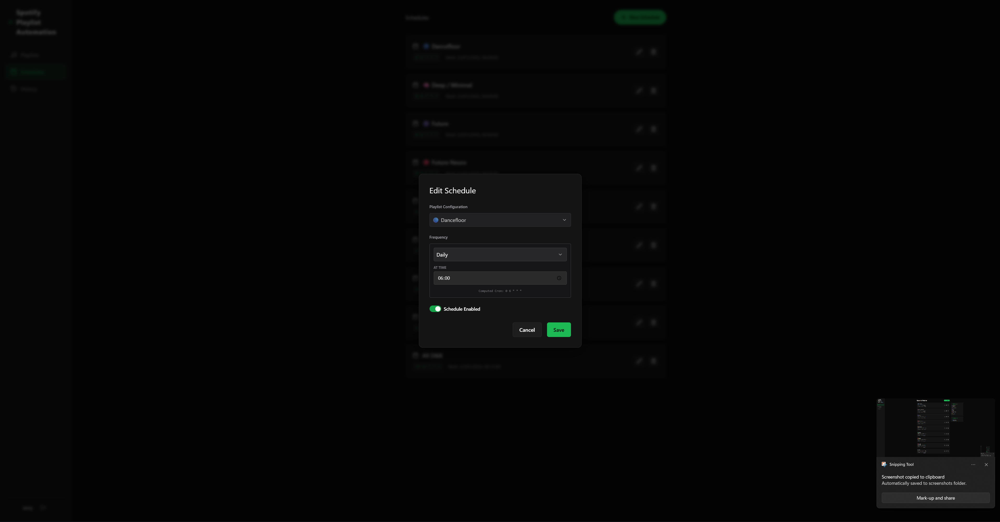 | 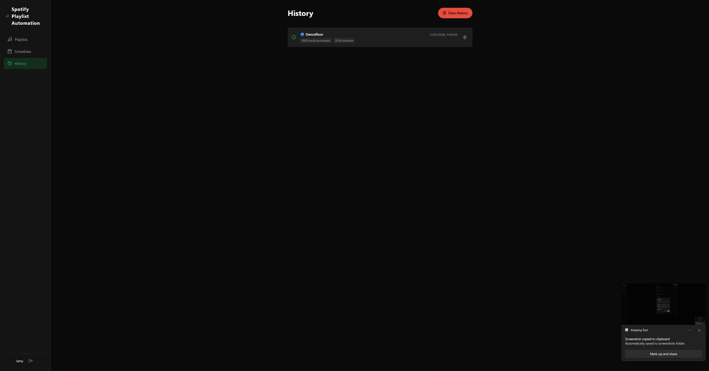 |

</details>

## Requirements

- **Spotify Developer Credentials**: You need your own Spotify API credentials
  1. Go to [Spotify Developer Dashboard](https://developer.spotify.com/dashboard)
  2. Create an application
  3. Add `http://127.0.0.1:27196` to Redirect URIs
  4. Copy your Client ID and Client Secret

## Installation

### From Release
Download the latest installer from the [Releases](../../releases) page.
- **Desktop App** (`Spotify Sorter_x.x.x_x64-setup.exe`): The standalone desktop application.
- **Server** (`spotify-sorter-server.exe`): The standalone server executable for headless/background automation.

### Build from Source

**Prerequisites:**
- [Node.js](https://nodejs.org/) (v18+)
- [Rust](https://rustup.rs/)
- [Tauri Prerequisites](https://tauri.app/v2/guides/prerequisites/)

```bash
# Clone the repository
git clone https://github.com/JamyPatel/Spotify-Sorter.git
cd spotify-sorter

# Install dependencies
npm install

# Run in development mode
npm run tauri dev

# Build for production
npm run tauri build
```

## Usage

1. Launch the application
2. Enter your Spotify Client ID and Client Secret
3. Authorize with Spotify (opens in browser)
4. Select playlists you want to process
5. Configure sorting rules, duplicate handling, and version options
6. Click "Run Process" to apply changes

## Security

- **No credentials are stored in the source code**
- Your Spotify tokens are stored locally in your system's secure storage
- All communication with Spotify uses OAuth 2.0

## Architecture

The project consists of two main components:
1. **Desktop App**: A beautiful, localized desktop application for manual cleaning and rapid configuration.
2. **Web Server**: A headless companion (Python/FastAPI) that runs in Docker to keep your dynamic playlists updated 24/7 based on your schedules.

---

## Tech Stack

- **Desktop**: React 19, TypeScript, Tailwind CSS, Rust, Tauri v2
- **Server**: Python 3.11, FastAPI, SQLAlchemy, Docker
- **Spotify API**: rspotify (Rust) & spotipy (Python)
- **State Management**: Zustand (Desktop) & SQL (Server)

## License

MIT License - see [LICENSE](LICENSE) for details.
